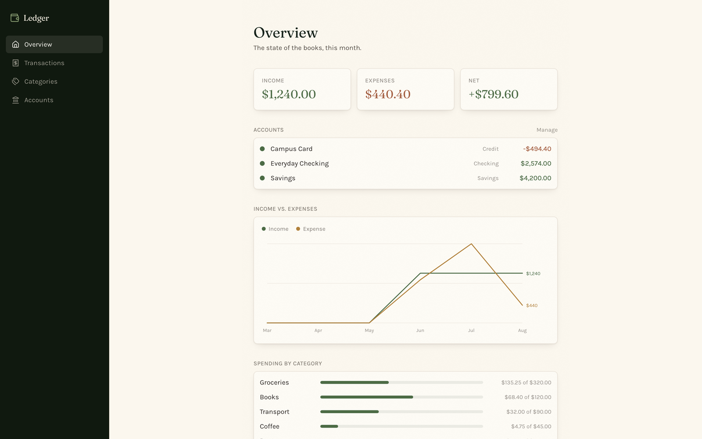
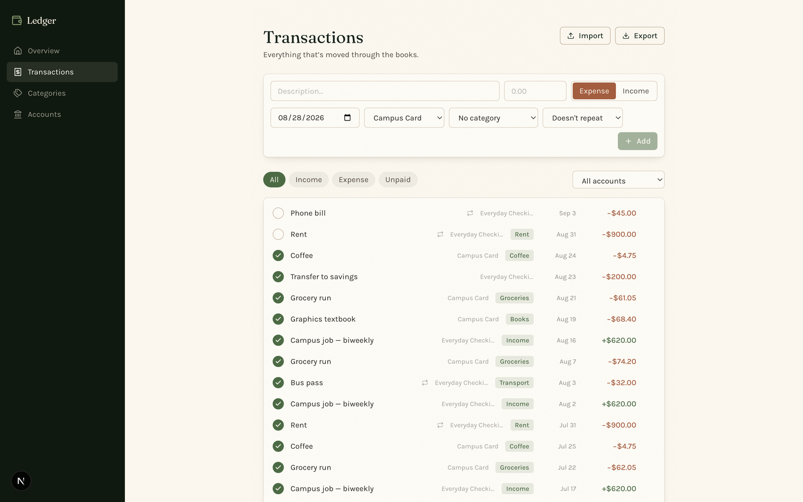

# Ledger

> Where the cabin keeps its books.

Personal finance tracking with no bank connection, no sync and no account: transactions, accounts, categories and budgets in a local SQLite file you own.



## What it does

**Accounts** — checking, savings, credit, cash — each with a starting balance. Balances are always computed live from `startingBalance + paid income − paid expenses`, never stored, so a corrected transaction can't leave a stale balance behind. An account with transactions can't be deleted; the API blocks it rather than orphaning rows.

**Transactions** are income or expense, paid or unpaid. Unpaid ones with a future date are the upcoming-bills view. A repeating transaction, once marked paid, leaves the original row as history and spawns the next occurrence — so completion history stays intact instead of being mutated away.

**Categories** carry an optional monthly budget, which drives the spending-by-category breakdown.

**Import** transactions from CSV, and a `/api/summary` endpoint reports the month's net to The Lodge.



## Stack

Next.js 16 (App Router) · React 19 · TypeScript · Tailwind 4 · Prisma + SQLite.

## Running it

```bash
npm install
npx prisma db push
npm run dev
```

Then open <http://localhost:3004>. The database lives at `~/Library/Application Support/Ledger/ledger.db`, outside the repo — nothing financial is ever committed.

## The cabin

Part of a set of local-first apps launched from [The Lodge](https://github.com/CamWhamBammus/the-lodge).
